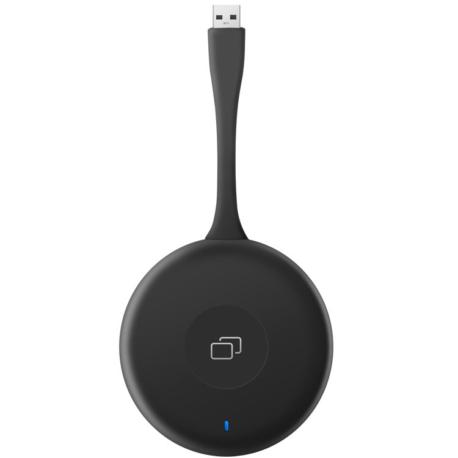

# airplay2 miracast
Airplay Airplay2 DLNA SDK Source code 源码 apple music mlti room 多房间音乐
www.basicgo.net/about
#
支持Android,windows,Linux.

#
#
#
#
==================================
#
Windows平台（接收安卓，苹果手机投屏软件）
1. 安装苹果公司组件Bonjour.msi
2. 安装应用程序ScreenGoSetup.msi

#
Windows平台，支持usb发射器

#
技术支持: alex_fan_sz@hotmail.com
出售Airplay SDK ,souce code 源码

The Windows/Android app supports airplay2 and dlna.

email: alex_fan_sz@hotmail.com
phone & wechat: 18718770267
