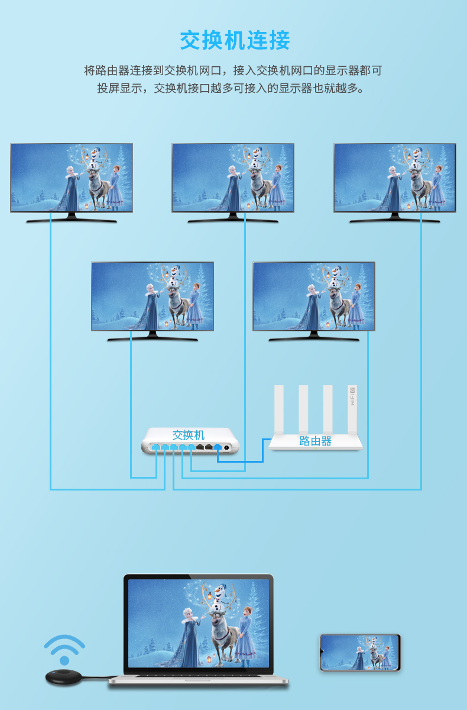
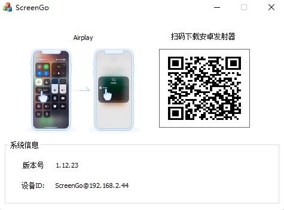

# airplay dlna googlecast
Airplay Airplay2 DLNA SDK Source code 源码
#
Android平台(接收安卓，苹果手机，windows电脑usb投屏器).
支持多播和广播， 不过家用wifi路由器多播和广播
丢包比较多，不知道是代码问题还是其他，有时间看看
接入有线交换机就比较稳定，据说优科的wifi路由器多播支持比较
好，不过有点费银子，没有用过

安装投屏狗电视端(screengo_tv.apk)到安卓电视或Tvbox,平板等大屏设备，
投屏狗电视端支持苹果Airplay, android投屏狗手机端(screengo.apk),Windows 电脑Usb投屏发射器[说明一下，windows usb投屏器不需要安装软件，即插即用，和下面windows接收软件是两个不同的项目)

#
#
#
#
==================================
#
Windows平台（接收安卓，苹果手机投屏软件）
1. 安装苹果公司组件Bonjour.msi
2. 安装应用程序ScreenGoSetup.msi
#

#
技术支持: alex_fan_sz@hotmail.com
出售Airplay SDK ,souce code 源码

The Windows/Android app supports airplay2 and dlna.
ChromeCast is coming soon.

email: alex_fan_sz@hotmail.com
phone & wechat: 18718770267
